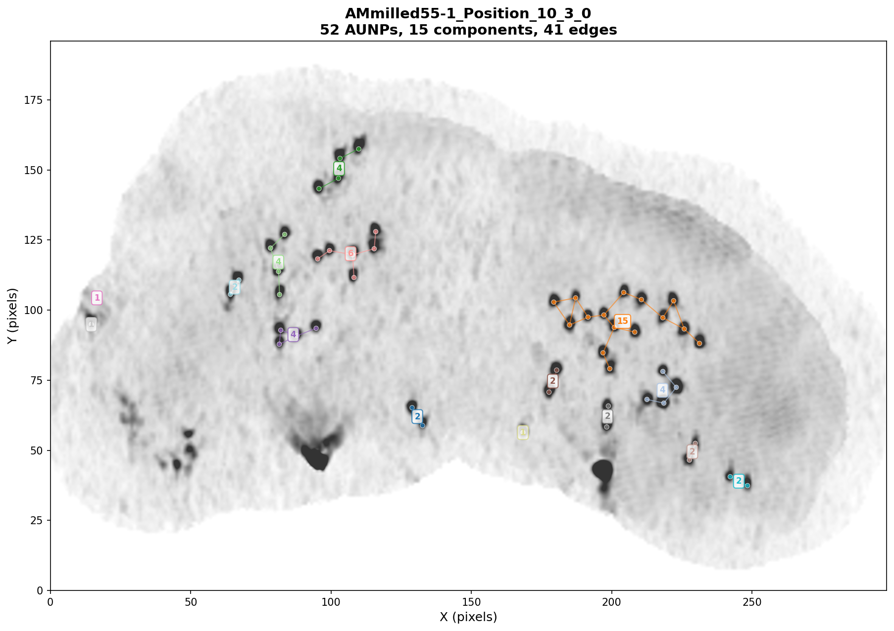
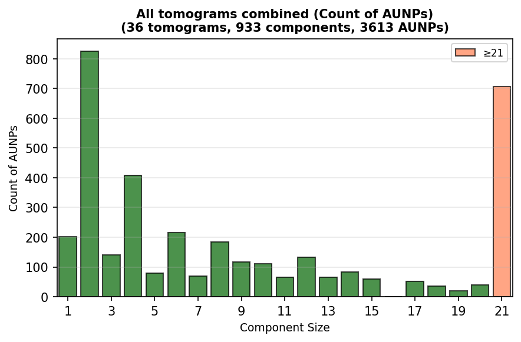
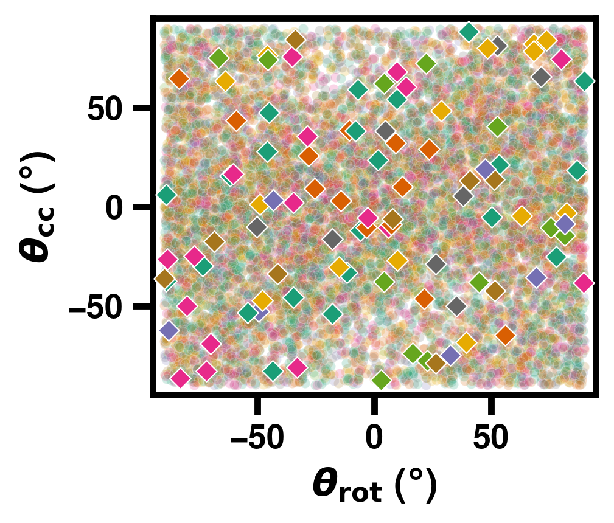
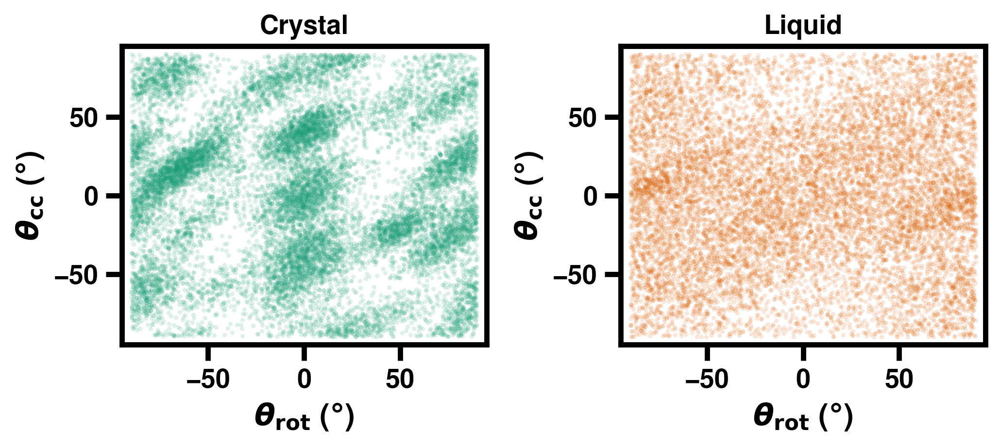
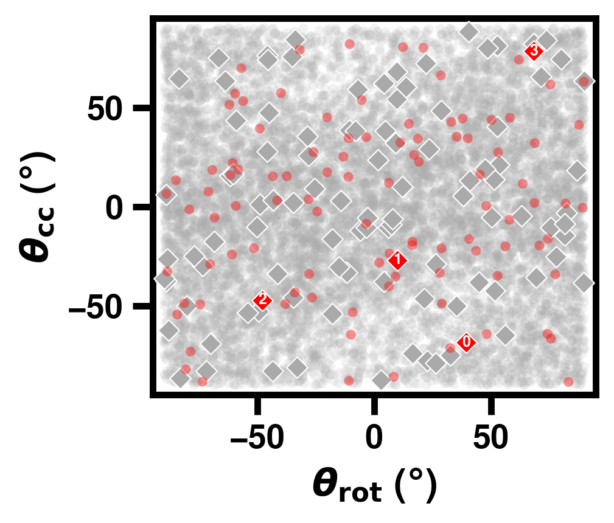
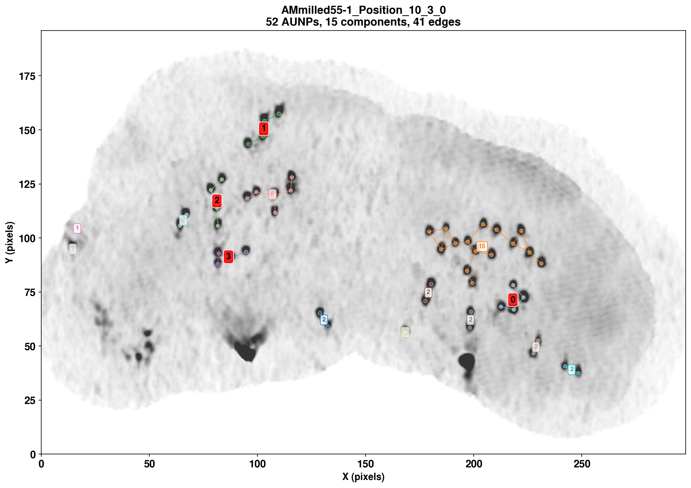

# AUNP Graph Pattern Analysis

Analysis pipeline for gold nanoparticle (AUNP) graph patterns in cryo-electron tomography data. Current distance cutoff for graph edges: **13 nm**.

| Component sizes (AM_milled55-1_Position_10_3) | Size distribution (AUNPs) |
|:---:|:---:|
|  |  |

Each point represents a set of 4 AuNPs and their pairwise angles. **Round dots** show all potential combinations of 4 AuNPs from larger connected components; **square dots** show only subgraphs that consist of exactly 4 AuNPs.

| Theta scatter | Simulated theta scatter |
|:---:|:---:|
|  |  

| Theta scatter (highlighting AM_milled55-1_Position_10_3) | Position of 4-size clusters |
|:---:|:---:|
|   |  |

## Setup

Install dependencies using uv:

```bash
uv sync
```

## Configuration

Edit `config.toml` to customize the analysis parameters:

- **Paths**: Set `basefolder` and `output_folder`
- **Tomograms**: List the tomograms to analyze in `tomos`
- **Graph parameters**: Adjust distance thresholds and subgraph size

## Workflow

The precomputation pipeline extracts subgraphs and computes angle-based features:

### 1. Extract Subgraphs (Fast, with diagnostics)

This step loads AUNP coordinates, builds proximity graphs, and extracts connected subgraphs. It also generates diagnostic plots showing the graphs and selected subgraphs for each tomogram.

```bash
uv run python src/precompute.py --stage subgraphs
```

**Outputs:**
- `output/subgraphs.pt`: Extracted subgraph coordinates
- `output/features.npy`: Angle-based features for each subgraph
- `output/feature_names.json`: Names of the computed angle features
- `output/metadata.json`: Metadata about the analysis
- `diagnostics/*_graph_subgraphs.png`: Per-tomogram plots showing highlighted subgraphs
- `diagnostics/*_graph_component_size.png`: Per-tomogram plots showing all components colored by size
- `diagnostics/summary.png`: Summary statistics (AUNP counts, subgraph counts)
- `diagnostics/component_size_distribution_subgraphs.png`: Distribution by count of subgraphs
- `diagnostics/component_size_distribution_aunps.png`: Distribution by count of AUNPs

### Command-line Options

- `--config path/to/config.toml`: Use a custom config file
- `--output-dir path/to/output`: Override output directory
- `--no-diagnostics`: Skip generating diagnostic plots
- `--force`: Force recomputation even if files exist
- `-v, --verbose`: Enable verbose logging

### 2. Plot Theta Scatter

After precomputing, generate scatter plots of subgraph angle features:

```bash
uv run python src/plot_theta_scatter.py
uv run python src/plot_theta_scatter.py -o figures/theta_scatter.png
```

This plots `theta_rot` vs `theta_cc` for all subgraphs, revealing clustering of crystalline vs. disordered AUNP arrangements. A custom config can be specified via the `AUNP_CONFIG` environment variable:

```bash
AUNP_CONFIG=config_h4kcys.toml uv run python src/plot_theta_scatter.py
```

### 3. Plot Simulated Theta Scatter

To compare against simulated crystal and liquid patterns:

```bash
uv run python src/plot_simulated_theta_scatter.py
uv run python src/plot_simulated_theta_scatter.py -o figures/sim_theta_scatter.png
uv run python src/plot_simulated_theta_scatter.py --noise-sigma 1.5
```

This loads particle positions from solid-vs-liquid 2D simulations, applies Gaussian noise to mimic localisation uncertainty, extracts subgraphs, and produces a two-panel hexbin density plot in the same style as `plot_theta_scatter.py`.

## Project Structure

```
.
├── config.toml                              # Configuration file
├── pyproject.toml                           # Python dependencies
├── src/
│   ├── config.py                           # Configuration loader
│   ├── data_loading.py                     # Data loading utilities
│   ├── graph_construction.py               # Graph building and subgraph extraction
│   ├── visualization.py                    # Diagnostic plots
│   ├── precompute.py                       # Precomputation script
│   ├── plot_theta_scatter.py               # Theta scatter plot (experimental data)
│   └── plot_simulated_theta_scatter.py     # Theta scatter plot (simulated data)
├── diagnostics/                             # Diagnostic plots (generated)
└── output/                                  # Precomputed data (generated)
    ├── subgraphs.pt
    ├── features.npy
    ├── feature_names.json
    └── metadata.json
```

## Modules

- **config**: Configuration management with TOML support
- **data_loading**: Load tomograms and STAR files
- **graph_construction**: Build proximity graphs and extract connected subgraphs
- **visualization**: Diagnostic plots for graph analysis
- **precompute**: Main precomputation script
- **plot_theta_scatter**: Scatter plot of angle features for experimental data
- **plot_simulated_theta_scatter**: Scatter plot of angle features for simulated data
